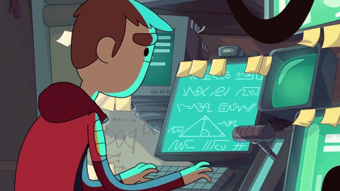

### Heyyyyyyy.... 👋 I am [Adnan Anjum](https://github.com/adnan3856/)

  

 

---
 

- 🔭 I’m currently working on ... Spring Framework
- 🌱 I’m currently learning spring framework & tensorflow
- 👯 I’m looking to collaborate on machine learning
- 🤔 I’m looking for help with ...Knowledge and ofcourse a smile
- 💬 Ask me about ...anything
- 📫 How to reach me: ...linkedin, instagram,mail
- 😄 Pronouns: ...We
- ⚡ Fun fact: ...I like to sketch and am a Graphics Designer too. Want to see some work, look at the gif below.
 
---

### 🏆 Github Status

 

 
